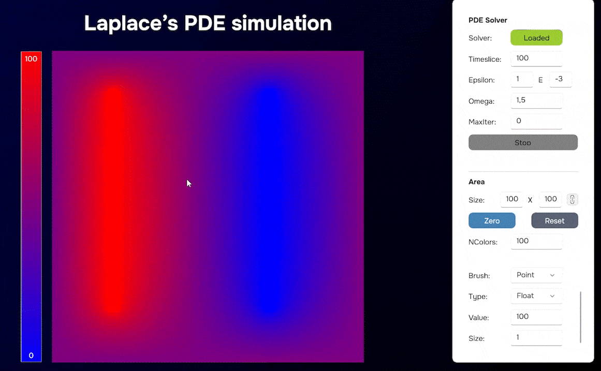
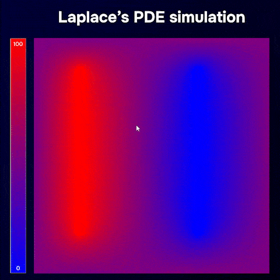
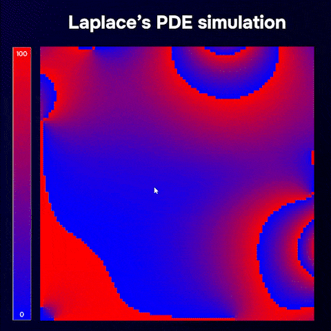

# Решение уравнения Лапласа методом последовательной сверхрелаксации

Этот проект представляет собой реализацию численного метода для решения уравнения Лапласа в частных производных с использованием метода последовательной сверхрелаксации по схеме "красное-чёрное".

## I. Описание

Уравнение Лапласа является эллиптическим дифференциальным уравнением, описывающим стационарное распределение потенциала в области, где потоки входящих и исходящих частиц равны. Этот проект предназначен для решения уравнения Лапласа в двумерной области с заданными значениями на границе.

## II. Функциональности

- Решение уравнения Лапласа внутри заданной области, используя метод последовательной сверхрелаксации.
- Аппроксимация решения во внутренних точках области, покрывая её равномерной сеткой точек.
- Вычисления выполняются до достижения заданной точности (epsilon), определяемой как разница между текущей и предыдущей итерацией.

## III. Использование

1. Запустите LaplaceSOR.Visualization
2. Нажмите на кнопку `Solver` и выберите .dll файл с типом, реализующим интерфейс `ILaplaceEquationSolver` из проекта LaplaceSOR.Contracts
3. Задайте настройки симуляции:

PDE Solver:

- `Timeslice`: это параметр, определяющий время ожидания (в миллисекундах) между итерациями решения уравнения
- `Omega`: представляет собой параметр релаксации, который контролирует скорость сходимости метода. Большие значения омега (обычно в диапазоне от 1 до 2) могут ускорить сходимость, но слишком большие значения могут привести к неустойчивости метода
- `Epsilon`: порог сходимости решения (точность решения)
- `MaxIterations`: ограничение количества итераций.
- `Start/Stop`: запуск и остановка solver PDE. При остановке на кнопке отображается «Start», и solver PDE ничего не делает.

Area:
- `Size` - размер области (рекомендуется отношение 1:1)
- `Zero` - временно не имеет функционала
- `Reset` - обновляет и перестраивает всю область элементами со значением 0.
- `NColors` - позволяет изменить количество цветов на дисплее. Цветной дисплей автоматически обновится, чтобы минимальное и максимальное значение соответствовало цветовому диапазону. Однако иногда интересно ограничить количество цветов, чтобы «увидеть больше».

Draw:
- `Brush` - выбирает тип кисти для рисования.
- `Type` - выбирает тип элементов, нарисованных мышью.
- `Value` - выберает значение для элементов, нарисованных мышью.
- `Size` - размер кисти (не распространяется на тип кисти Point)

4. Нажмите на `Start` и наблюдайте за процессом визуализации.
5. Сбросьте симуляцию или остановите solver в любое время.

P.s во время визуализации можно продолжать рисовать. Попробуйте. Это красиво.

## IV. Примеры

1. Две линии фиксированного типа (Красная - потенциал значение 100, синяя - 0)

2. Запуски и завершение симуляции. 

3. Ограничение кол-ва цветов для отрисовки.

# Анимации
Рисование клеток типа Float, разными кисточками и в разных ситуациях. 

## V. Solvers (Решатели .dll)

В репозитории представлены два решателя (solvers).
Их код практически идентичен, но функциональный посыл немного различается.

1. LaplaceSOR.Solving.dll
    - Все клетки на границах области - фиксированные (то есть алгоритм решения их не изменяет)
    - Все внутренние клетки - нефиксированные. (алгоритм не учитывает типы клеток при расчетах и изменяет значение во всех внутренних клетках в процессе вычислений, даже если они являются фиксированными.

2. LaplaceEquationDynamicFixedSolver.dll:
    - Все клетки на границах области - фиксированные.
    - Он учитывает типы всех ячеек и сохраняет значения в фиксированных клетках и изменяет в нефиксированных (float) клетках.